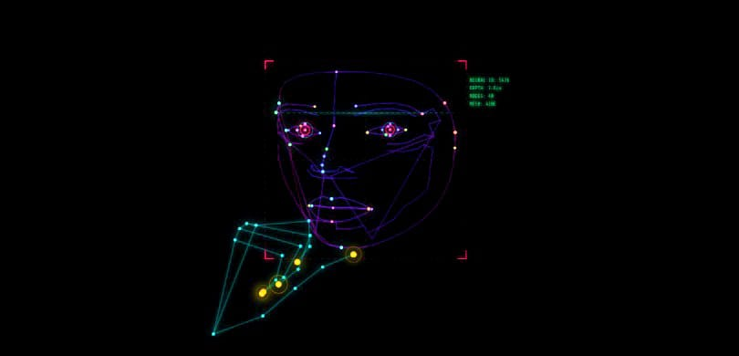
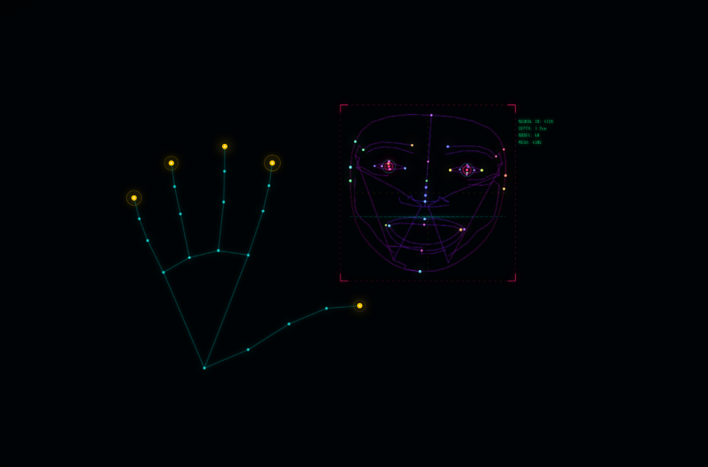
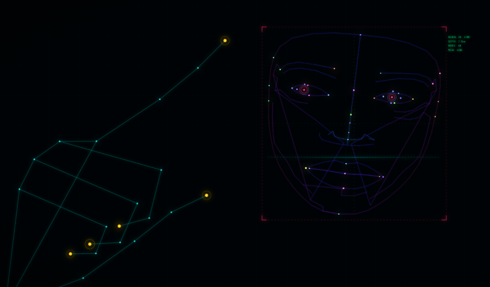

<div align="center">

<table>
<tr>
<td align="center" width="150">
  
</td>
<td align="left">
  <h1 style="margin: 0;">Qats Qradle ™</h1>
  <p><em>

NeuralNetworks Simulation is now Accelerated to Man's handtips -  Addictive way to waste  your egronomics, Cyberpunk future is now closer than you imagine</em></p>
</td>
</tr>
</table>

<p align="center">
  <a href="https://github.com/aura7822/catscradle" target="_blank">
    
  </a><a href="https://buymeacoffee.com/aura7822" target="_blank">
    
  </a>
</p>





[](#)
[](#)
[](#)

[](#)
[](#)
[](#)
[](#)
[](#)


copyright © 2026 Aura Joshua - All rights reserved

</div>


<div align ="center">
  
##  Overview

</div>

**Cats Cradle™** is an interactive visual experiment that simulates neural-like structures emerging from fingertip motion. As your hand moves through space, luminous nodes and connective lines are woven into a living digital mesh, echoing the formation of synapses in an artificial cortex.

The result is a cybernetic tapestry where human motion becomes the architect of a synthetic mind.

---
<div align="center">
  
##  Features

</div>

-  Finger-tracking based interaction
-  Real-time neural network visualization
-  Cyberpunk-inspired neon aesthetics
-  Dynamic node and edge generation
-  Particle-based rendering on a dark canvas
-  Screenshot-friendly visual output


---

<div align="center">
  
##  Preview

</div>

<div align="center">
<table>
  <tr>
    <td>
      
      <td>
          
  </tr>
</table>

  
</div>

---
<div align="center">
  
## OS Launching [linux & unix systems]

</div>

### Run as whole

```bash
#bash/zshell
git clone git@github.com:aura7822/cat-s-cradle.git
cd cat-s-cradle
chmod +x ./launch
./launch

```
### 🛈 Tip :
The POSIX shell entry point is launch.sh. The script resolves its own directory, changes the working directory to the project root, and invokes launcher.py using the system's default python3 interpreter.

<div align="center">
  
## OS  Launching [Windows systems]

</div>

```cmd
#cmd
launch.bat
```
---
```powershell
#powershell
.\launch.ps1
```
### 🛈 Tip:
For systems where a Python runtime is not guaranteed, a self-contained executable can be generated using PyInstaller.

```cmd
#cmd
python build_windows_exe.py
dist\launcher.exe
```
<div align="center">

## SUPPORT

<table>
  <thead>
    <tr>
      <th>Browsers</th>
      <th>Platforms / Distributions</th>
    </tr>
  </thead>
  <tbody>
    <tr>
      <td>
        <a href="#">
          
        </a>
      </td>
      <td>
        <a href="#">
          
        </a>
      </td>
    </tr>
    <tr>
      <td>
        <a href="#">
          
        </a>
      </td>
      <td>
        <a href="#">
          
        </a>
      </td>
    </tr>
    <tr>
      <td>
        <a href="#">
          
        </a>
      </td>
      <td>
        <a href="#">
          
        </a>
      </td>
    </tr>
    <tr>
      <td>
        <a href="#">
          
        </a>
      </td>
      <td>
        <a href="#">
          
        </a>
      </td>
    </tr>
    <tr>
      <td>
        <a href="#">
          
        </a>
      </td>
      <td>
        <a href="#">
          
        </a>
      </td>
    </tr>
  </tbody>
</table>

</div>

